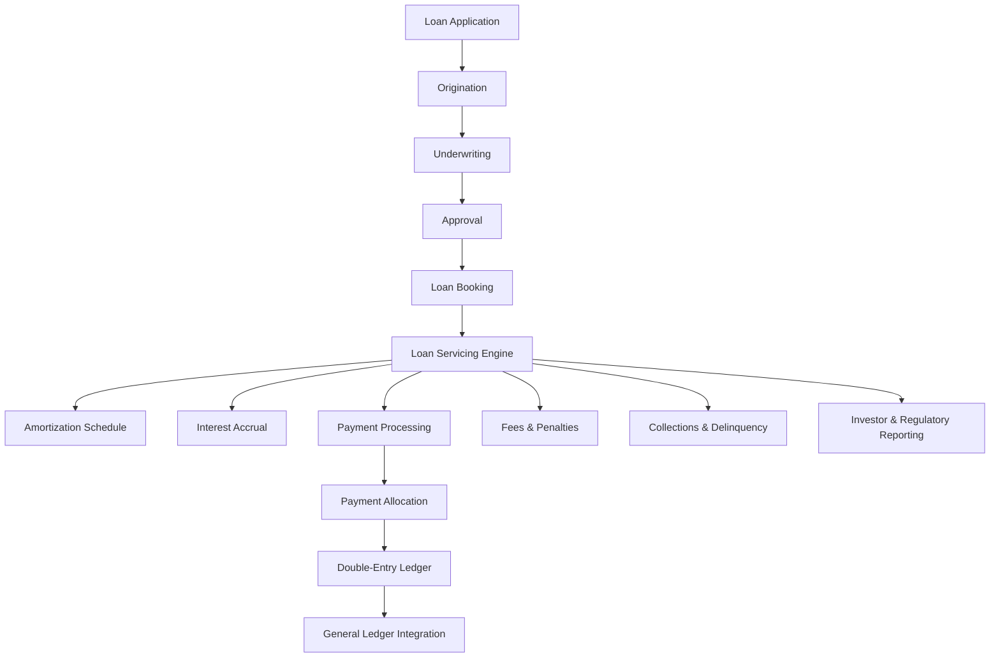
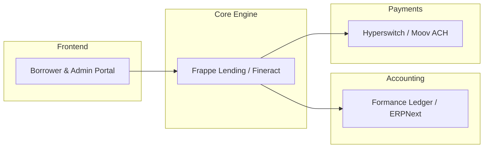

# 💰 Awesome Loan Servicing Platform & Open-Source Lending Engines



<a href="https://github.com/ishandutta2007/Awesome-Awesome-Awesome"></a> <a href="https://discord.gg/jc4xtF58Ve"></a> [](https://opensource.org/licenses/MIT) <a href="https://github.com/ishandutta2007"></a>

> A curated list of **loan servicing platforms, loan management systems (LMS), lending cores, commercial lending platforms, mortgage servicing systems, double-entry financial ledgers, and open-source loan servicing software**.

Loan servicing software manages the **post-origination lifecycle of loans**, including:

* 📋 **Loan Boarding**
* 📅 **Amortization Schedules**
* 💵 **Interest Accrual & Day-Count Calculations**
* 💳 **Payment Processing & Automated Clearing (ACH / Wires)**
* ⚖️ **Payment Allocation Rules (Fees → Interest → Principal)**
* 📊 **Principal and Interest Tracking**
* 🏷️ **Fee Management & Late Charges**
* 🛡️ **Escrow Management (Taxes & Insurance)**
* 🚨 **Delinquency Management & DPD Tracking**
* 📞 **Collections & Promise-to-Pay Workflows**
* 📉 **Charge-offs & Non-Performing Loan (NPL) Accounting**
* 🔄 **Loan Modifications & Restructuring**
* 🏁 **Payoff Calculations & Collateral Release**
* 📑 **Borrower Statements & Communication**
* 🏠 **Collateral & Lien Tracking**
* 🧾 **Loan Accounting & Double-Entry Ledgers**
* 🏦 **General Ledger Integration**
* 📈 **Investor Reporting & Secondary Market Servicing**
* 💼 **Portfolio Risk & Performance Analytics**
* 🔍 **Bank Reconciliation & Audit Trails**
* ⚖️ **Regulatory Reporting & Compliance (TCPA, FDCPA, CECL)**

The modern loan-servicing stack seamlessly connects **loan origination → underwriting → servicing → payments → collections → accounting → reporting**.

This repository focuses primarily on **open-source and self-hostable alternatives**, while maintaining a comprehensive list of enterprise commercial platforms such as FIS, Fiserv LoanServ, Temenos, LoanPro, TurnKey Lender, Nortridge, Shaw Systems, Finastra Loan IQ, FICS, Sagent, CreditOnline, and Mortgage Automator.

> 💡 **Important:** Open-source lending software is mature in **core banking, loan management systems (LMS), and financial ledgers** (e.g. Apache Fineract, Frappe Lending, Formance Ledger). However, specialized enterprise mortgage and commercial loan servicing often require composable integrations of multiple open-source modules.

---

## 📑 Table of Contents

* [☁️ Commercial SaaS & Hosted Platforms](#️-commercial-saas--hosted-platforms)
* [🌍 Open-Source Lending Ecosystem](#-open-source-lending-ecosystem)
* [🏦 Open-Source Core Banking & Loan Management](#-open-source-core-banking--loan-management)
* [💰 Open-Source Loan Servicing](#-open-source-loan-servicing)
* [🧮 Open-Source Loan Accounting & Ledgers](#-open-source-loan-accounting--ledgers)
* [💳 Open-Source Loan Payment Processing](#-open-source-loan-payment-processing)
* [📅 Open-Source Amortization & Interest Engines](#-open-source-amortization--interest-engines)
* [📈 Open-Source Collections & Delinquency](#-open-source-collections--delinquency)
* [🏠 Open-Source Mortgage & Real Estate Lending](#-open-source-mortgage--real-estate-lending)
* [🏢 Open-Source Commercial Lending](#-open-source-commercial-lending)
* [🤖 Open-Source Loan Origination](#-open-source-loan-origination)
* [🔐 Open-Source Credit & Risk Infrastructure](#-open-source-credit--risk-infrastructure)
* [🧾 Open-Source Accounting & Reconciliation](#-open-source-accounting--reconciliation)
* [⚙️ Open-Source Fintech Infrastructure](#️-open-source-fintech-infrastructure)
* [🧩 Commercial Platform → Open-Source Equivalent](#-commercial-platform--open-source-equivalent)
* [🏗️ Loan Servicing Architecture](#️-loan-servicing-architecture)
* [🔄 Open-Source Loan Servicing Architecture](#-open-source-loan-servicing-architecture)
* [💸 Loan Payment & Ledger Architecture](#-loan-payment--ledger-architecture)
* [📊 Loan Lifecycle](#-loan-lifecycle)
* [⚖️ Commercial vs Open-Source](#️-commercial-vs-open-source)
* [🚀 Recommended Open-Source Stacks](#-recommended-open-source-stacks)
* [📊 Loan Servicing Technology Comparison](#-loan-servicing-technology-comparison)
* [🎯 Recommended Projects by Use Case](#-recommended-projects-by-use-case)
* [🏢 Building a LoanPro Alternative](#-building-a-loanpro-alternative)
* [🏦 Building an Open-Source Loan Servicing Platform](#-building-an-open-source-loan-servicing-platform)
* [🌐 Open-Source Lending Landscape](#-open-source-lending-landscape)
* [🧠 Why Open-Source Loan Servicing Matters](#-why-open-source-loan-servicing-matters)
* [📈 Star History](#-star-history)
* [💖 Support & Community](#-support--community)
* [🤝 Contributing](#-contributing)
* [⚠️ Disclaimer](#️-disclaimer)

---

# ☁️ Commercial SaaS & Hosted Platforms

> 📊 **Market Size & Industry Structure:** The global loan servicing software market is estimated at **$8.5 Billion in 2025/2026** and is projected to reach **$16.8 Billion by 2032** growing at a CAGR of 11.2%. The market is **moderately fragmented**, balancing legacy enterprise core banking conglomerates (FIS, Fiserv, Temenos, Finastra) with specialized cloud-native loan servicing vendors (LoanPro, Nortridge, Sagent, TurnKey Lender).

| Platform | Company | Valuation / Revenue (Company Size) | Starting Pricing | Free Tier / Trial Limits | Primary Focus & Capabilities |
| :--- | :--- | :--- | :--- | :--- | :--- |
| [FIS](https://www.fisglobal.com/) | FIS | **$98.0B Valuation** ($14.6B Rev) | **$2,500 / month** base platform fee | **30-day** developer sandbox trial with sample data | Enterprise loan servicing, consumer lending, payments and financial processing |
| [Fiserv LoanServ](https://www.fiserv.com/) | Fiserv | **$85.0B Valuation** ($19.1B Rev) | **$3,000 / month** base platform fee | **30-day** enterprise sandbox trial | Enterprise consumer lending, loan servicing, payments and core processing |
| [Temenos](https://www.temenos.com/) | Temenos | **$6.5B Valuation** ($1.0B Rev) | **$1,500 / month** per tenant instance | **14-day** cloud sandbox trial with API documentation | Core banking, cloud lending and financial servicing |
| [Mambu](https://www.mambu.com/) | Mambu | **$5.3B Valuation** ($150M Rev) | **$1,000 / month** base tenant | **14-day** developer sandbox trial | Cloud-native banking engine and flexible lending infrastructure |
| [nCino](https://www.ncino.com/) | nCino | **$3.5B Valuation** ($500M Rev) | **$1,200 / month** per seat/module | **14-day** guided platform demo sandbox | Cloud banking, commercial lending and loan lifecycle management |
| [Finastra Loan IQ](https://www.finastra.com/solutions/lending/loan-iq) | Finastra | **$3.0B Valuation** ($1.1B Rev) | **$2,000 / month** base environment | **30-day** developer portal sandbox access | Commercial loan management, syndication, servicing and lifecycle management |
| [LoanPro](https://www.loanpro.io/) | LoanPro | **$500M Valuation** ($50M Rev) | **$500 / month** base fee | **14-day** free trial with sandbox API access | API-first modern loan servicing, payments, lending core and automation |
| [Sagent](https://www.sagent.com/) | Sagent | **$350M Valuation** ($80M Rev) | **$1,500 / month** servicing license | **30-day** demo portal access | Enterprise mortgage servicing, borrower portals and servicing operations |
| [Nucleus Software](https://www.nucleussoftware.com/) | Nucleus Software | **$300M Valuation** ($90M Rev) | **$800 / month** module license | **30-day** evaluation instance | Retail lending, transaction banking and servicing |
| [defi SOLUTIONS](https://www.defisolutions.com/) | defi SOLUTIONS | **$200M Valuation** ($75M Rev) | **$750 / month** base fee | **14-day** demo sandbox trial | Auto and consumer loan origination, servicing and decisioning |
| [TurnKey Lender](https://www.turnkey-lender.com/) | TurnKey Lender | **$50M Valuation** ($15M Rev) | **$499 / month** starting tier | **14-day** free trial, up to 10 active test loans | End-to-end lending, origination, underwriting, servicing and collections |
| [Nortridge](https://nortridge.com/) | Nortridge Software | **$40M Valuation** ($12M Rev) | **$350 / month** starting tier | **30-day** desktop/cloud evaluation version | Configurable loan servicing, complex loan portfolios and origination |
| [Shaw Systems](https://www.shawsystems.com/) | Shaw Systems | **$35M Valuation** ($10M Rev) | **$600 / month** base tier | **30-day** demo environment | Consumer and commercial loan servicing, collections and portfolio management |
| [FICS](https://www.fics.com/) | FICS | **$30M Valuation** ($8M Rev) | **$450 / month** starting tier | **30-day** evaluation trial | Mortgage servicing, loan accounting and portfolio management |
| [Lendscape](https://www.lendscape.com/) | Lendscape | **$25M Valuation** ($7M Rev) | **$400 / month** base module | **14-day** sandbox access | Commercial lending, asset finance and loan servicing |
| [HES LoanBox](https://www.hesfintech.com/) | HES FinTech | **$20M Valuation** ($5M Rev) | **$350 / month** base plan | **14-day** free trial with sample portfolio | Loan origination, credit decisioning and servicing automation |
| [Mortgage Automator](https://www.mortgageautomator.com/) | Mortgage Automator | **$15M Valuation** ($4M Rev) | **$299 / month** starting tier | **14-day** free trial, up to 15 test loans | Private and mortgage lending origination, servicing and administration |
| [The Mortgage Office](https://www.themortgageoffice.com/) | ABS | **$15M Valuation** ($4M Rev) | **$250 / month** base module | **30-day** trial with full feature access | Mortgage loan servicing, investor management and mortgage accounting |
| [Margill](https://www.margill.com/) | Margill | **$10M Valuation** ($3M Rev) | **$95 / month** standard license | **30-day** full feature free trial | Amortization calculations, loan servicing and portfolio analysis |
| [AutoPal](https://www.autopal.info/) | AutoPal Software | **$8M Valuation** ($2M Rev) | **$199 / month** base plan | **14-day** free trial, up to 25 test loans | Consumer finance and loan servicing |
| [Bryt](https://www.brytsoftware.com/) | Bryt Software | **$5M Valuation** ($1.5M Rev) | **$149 / month** standard plan | **14-day** free trial, unlimited test accounts | Cloud loan servicing and lending automation |

---

# 🌍 Open-Source Lending Ecosystem

The open-source ecosystem is more **composable** than the commercial loan-servicing market.

Instead of finding one monolithic "open-source LoanPro", a self-hosted implementation can combine:

```text
                    OPEN-SOURCE LENDING
                             │
        ┌───────────────────┼───────────────────┐
        │                   │                   │
        ▼                   ▼                   ▼
   Core Banking          Loan LMS             Ledger
        │                   │                   │
        ▼                   ▼                   ▼
     Fineract          Frappe Lending        Formance
     Mifos X              Odoo/ERPNext         Kill Bill
        │                   │                   │
        └───────────────────┼───────────────────┘
                            │
                            ▼
                    Payments / Collections
                            │
                            ▼
                     Accounting / BI
```

---

# 🏦 Open-Source Core Banking & Loan Management

| Project | Stars | Description | License |
| :--- | :--- | :--- | :--- |
| [Odoo Community](https://github.com/odoo/odoo) | [](https://github.com/odoo/odoo/stargazers) | Open-source enterprise business platform with financial ledgers & loan apps | LGPL-3.0 |
| [ERPNext](https://github.com/frappe/erpnext) | [](https://github.com/frappe/erpnext/stargazers) | Open-source ERP with financial ledgers, interest engines, and loan accounting | GPL-3.0 |
| [Apache Fineract](https://github.com/apache/fineract) | [](https://github.com/apache/fineract/stargazers) | Open-source core banking and loan management platform | Apache-2.0 |
| [Frappe Lending](https://github.com/frappe/lending) | [](https://github.com/frappe/lending/stargazers) | Dedicated 100% open-source loan management and servicing system | GPL-3.0 |
| [Mifos X](https://github.com/openMF/mifos-x) | [](https://github.com/openMF/mifos-x/stargazers) | Web financial application & UI distribution built around Apache Fineract | MPL-2.0 |
| [Fineract CN](https://github.com/apache/fineract-cn) | [](https://github.com/apache/fineract-cn/stargazers) | Cloud-native, microservices-based financial architecture | Apache-2.0 |

---

# 💰 Open-Source Loan Servicing

## Frappe Lending

[Frappe Lending](https://github.com/frappe/lending) [](https://github.com/frappe/lending/stargazers) explicitly targets the full loan servicing lifecycle:

* 📌 Loan booking & Disbursement
* 📌 Repayment schedules & Interest calculation
* 📌 Portfolio & Collateral management
* 📌 Collections & Co-lending workflows
* 📌 Loan transfers & Compliance reporting

```text
Loan Application ──► Loan Approval ──► Loan Booking ──► Disbursement ──► Amortization ──► Repayment ──► Collections ──► Payoff / Closure
```

## Apache Fineract

[Apache Fineract](https://github.com/apache/fineract) [](https://github.com/apache/fineract/stargazers) provides API-driven servicing capabilities:

```text
Customer ──► Loan Product ──► Loan Account (Schedule, Accrual, Payments, Charges, Accounting, Reporting)
```

---

# 🧮 Open-Source Loan Accounting & Ledgers

| Project | Stars | Role & Description | License |
| :--- | :--- | :--- | :--- |
| [Odoo Community](https://github.com/odoo/odoo) | [](https://github.com/odoo/odoo/stargazers) | Enterprise accounting and double-entry financial ledger | LGPL-3.0 |
| [ERPNext](https://github.com/frappe/erpnext) | [](https://github.com/frappe/erpnext/stargazers) | General accounting, general ledger & interest accruals | GPL-3.0 |
| [Formance Ledger](https://github.com/formancehq/ledger) | [](https://github.com/formancehq/ledger/stargazers) | Programmable double-entry financial ledger for loan transactions | Apache-2.0 |
| [Kill Bill](https://github.com/killbill/killbill) | [](https://github.com/killbill/killbill/stargazers) | Subscription billing and recurring transaction engine | Apache-2.0 |
| [Apache Fineract](https://github.com/apache/fineract) | [](https://github.com/apache/fineract/stargazers) | Integrated loan accounting & general ledger mapping | Apache-2.0 |
| [Frappe Lending](https://github.com/frappe/lending) | [](https://github.com/frappe/lending/stargazers) | Integrated loan product accounting & portfolio tracking | GPL-3.0 |

---

# 💳 Open-Source Loan Payment Processing

| Project | Stars | Role & Description | License |
| :--- | :--- | :--- | :--- |
| [Hyperswitch](https://github.com/juspay/hyperswitch) | [](https://github.com/juspay/hyperswitch/stargazers) | High-performance open-source payment orchestration engine | Apache-2.0 |
| [Kill Bill](https://github.com/killbill/killbill) | [](https://github.com/killbill/killbill/stargazers) | Payment gateway routing & subscription payment engine | Apache-2.0 |
| [Moov ACH](https://github.com/moov-io/ach) | [](https://github.com/moov-io/ach/stargazers) | Open-source ACH payment file creation and validation for loans | Apache-2.0 |
| [Moov Paygate](https://github.com/moov-io/paygate) | [](https://github.com/moov-io/paygate/stargazers) | Financial transaction gateway connecting banks to FedACH & wires | Apache-2.0 |
| [jPOS](https://github.com/jpos/jPOS) | [](https://github.com/jpos/jPOS/stargazers) | ISO 8583 payment processing framework for debit card loan repayment | AGPL-3.0 |
| [Mojaloop](https://github.com/mojaloop/mojaloop) | [](https://github.com/mojaloop/mojaloop/stargazers) | Open-source software for interoperable digital payment networks | Apache-2.0 |

---

# 📅 Open-Source Amortization & Interest Engines

| Project | Stars | Role & Description | License |
| :--- | :--- | :--- | :--- |
| [QuantLib](https://github.com/lballabio/QuantLib) | [](https://github.com/lballabio/QuantLib/stargazers) | Quantitative-finance library for complex interest & yield curve math | BSD-3-Clause |
| [Apache Fineract](https://github.com/apache/fineract) | [](https://github.com/apache/fineract/stargazers) | Loan schedule calculations (declining balance, flat, equal installments) | Apache-2.0 |
| [Frappe Lending](https://github.com/frappe/lending) | [](https://github.com/frappe/lending/stargazers) | Loan schedules, interest accruals, and late penalty calculators | GPL-3.0 |
| [Mifos X](https://github.com/openMF/mifos-x) | [](https://github.com/openMF/mifos-x/stargazers) | Loan product interest rate calculations & amortization engines | MPL-2.0 |
| [OpenGamma Strata](https://github.com/OpenGamma/Strata) | [](https://github.com/OpenGamma/Strata/stargazers) | Financial calculations library for interest rate risk & pricing | Apache-2.0 |
| [Apache Commons Math](https://github.com/apache/commons-math) | [](https://github.com/apache/commons-math/stargazers) | Mathematical building blocks for loan schedule calculations | Apache-2.0 |

---

# 📈 Open-Source Collections & Delinquency

| Project | Stars | Role & Description | License |
| :--- | :--- | :--- | :--- |
| [Temporal](https://github.com/temporalio/temporal) | [](https://github.com/temporalio/temporal/stargazers) | Durable execution engine for reliable collection retry workflows | MIT |
| [Camunda](https://github.com/camunda/camunda) | [](https://github.com/camunda/camunda/stargazers) | BPMN process engine for dunning cycles and delinquency escalation | Apache-2.0 |
| [Apache Fineract](https://github.com/apache/fineract) | [](https://github.com/apache/fineract/stargazers) | DPD tracking, loan delinquency aging, and charge-off rules | Apache-2.0 |
| [Frappe Lending](https://github.com/frappe/lending) | [](https://github.com/frappe/lending/stargazers) | Loan collection queues, promises-to-pay, and delinquency actions | GPL-3.0 |
| [Mifos X](https://github.com/openMF/mifos-x) | [](https://github.com/openMF/mifos-x/stargazers) | Loan portfolio delinquency tracking and officer management | MPL-2.0 |

---

# 🔐 Open-Source Credit & Risk Infrastructure

| Project | Stars | Role & Description | License |
| :--- | :--- | :--- | :--- |
| [scikit-learn](https://github.com/scikit-learn/scikit-learn) | [](https://github.com/scikit-learn/scikit-learn/stargazers) | Machine learning library for credit scoring and risk modeling | BSD-3-Clause |
| [XGBoost](https://github.com/dmlc/xgboost) | [](https://github.com/dmlc/xgboost/stargazers) | Optimized gradient boosting library for default risk predictions | Apache-2.0 |
| [MLflow](https://github.com/mlflow/mlflow) | [](https://github.com/mlflow/mlflow/stargazers) | Machine learning lifecycle platform for credit decision models | Apache-2.0 |
| [LightGBM](https://github.com/microsoft/LightGBM) | [](https://github.com/microsoft/LightGBM/stargazers) | Fast gradient boosting framework for credit scoring models | MIT |
| [Open Policy Agent (OPA)](https://github.com/open-policy-agent/opa) | [](https://github.com/open-policy-agent/opa/stargazers) | Policy decision engine for automated credit underwriting rules | Apache-2.0 |
| [Camunda](https://github.com/camunda/camunda) | [](https://github.com/camunda/camunda/stargazers) | DMN decision tables for credit underwriting workflows | Apache-2.0 |
| [Feast](https://github.com/feast-dev/feast) | [](https://github.com/feast-dev/feast/stargazers) | Feature store for real-time credit scoring features | Apache-2.0 |

---

# 🏠 Open-Source Mortgage & Real Estate Lending

Mortgage servicing requires specialized handling of escrow (taxes & insurance), investor reporting, and compliance. An open-source stack combines:

```text
Apache Fineract + Frappe Lending + Formance Ledger + Temporal Workflow + PostgreSQL
```

---

# 🏢 Open-Source Commercial Lending

Commercial lending (syndications, multi-facility drawdowns, covenants) can leverage composable tools:

| Project | Stars | Role |
| :--- | :--- | :--- |
| [Apache Fineract](https://github.com/apache/fineract) | [](https://github.com/apache/fineract/stargazers) | Lending Core & Account Management |
| [Formance Ledger](https://github.com/formancehq/ledger) | [](https://github.com/formancehq/ledger/stargazers) | Complex Double-Entry Ledger |
| [QuantLib](https://github.com/lballabio/QuantLib) | [](https://github.com/lballabio/QuantLib/stargazers) | Commercial Rate & Yield Calculations |
| [Temporal](https://github.com/temporalio/temporal) | [](https://github.com/temporalio/temporal/stargazers) | Facility Drawdown & Approval Workflows |

---

# 🤖 Open-Source Loan Origination

Loan servicing begins after origination:

```text
Application ──► Origination (KYC / Credit Check / Underwriting) ──► Loan Booking ──► Servicing Engine
```

---

# 🧾 Open-Source Accounting & Reconciliation

| Project | Stars | Function |
| :--- | :--- | :--- |
| [Odoo Community](https://github.com/odoo/odoo) | [](https://github.com/odoo/odoo/stargazers) | Full Financial Accounting & Reporting |
| [ERPNext](https://github.com/frappe/erpnext) | [](https://github.com/frappe/erpnext/stargazers) | General Ledger & Bank Reconciliation |
| [Formance Ledger](https://github.com/formancehq/ledger) | [](https://github.com/formancehq/ledger/stargazers) | Immutable Transaction Ledger |
| [Apache Fineract](https://github.com/apache/fineract) | [](https://github.com/apache/fineract/stargazers) | Portfolio Financial Accounting |

---

# ⚙️ Open-Source Fintech Infrastructure

| Layer | Open-Source Projects |
| :--- | :--- |
| **Core Banking** | Apache Fineract, Mifos X |
| **Loan Management** | Frappe Lending |
| **Ledger** | Formance Ledger, ERPNext |
| **Payments** | Hyperswitch, Moov Paygate |
| **ACH / Wires** | Moov ACH |
| **Workflows** | Temporal, Camunda |
| **Risk & Credit** | XGBoost, LightGBM, scikit-learn |

---

# 🧩 Commercial Platform → Open-Source Equivalent

| Commercial Platform | Open-Source Equivalent / Composable Building Blocks |
| :--- | :--- |
| **LoanPro** | Frappe Lending + Formance Ledger + Hyperswitch |
| **TurnKey Lender** | Frappe Lending + Apache Fineract + Temporal |
| **Nortridge** | Frappe Lending + Apache Fineract + Camunda |
| **Fiserv LoanServ** | Apache Fineract + Formance Ledger + ERPNext |
| **Finastra Loan IQ** | Apache Fineract + Formance + QuantLib |
| **Sagent** | Apache Fineract + Frappe Lending + Temporal |
| **Mambu** | Apache Fineract + Formance Ledger |

---

# 🏗️ Loan Servicing Architecture



---

# 🔄 Open-Source Loan Servicing Architecture



---

# 💸 Loan Payment & Ledger Architecture

```text
Borrower Payment ──► Payment Gateway (Moov/Hyperswitch) ──► Payment Allocation (Fees -> Interest -> Principal) ──► Immutable Double-Entry Ledger (Formance)
```

---

# 📊 Loan Lifecycle

```text
Origination ──► Booking ──► Active Servicing ──► Delinquency (DPD 1+) ──► Restructure / Payoff ──► Closed
```

---

# ⚖️ Commercial vs Open-Source

| Criteria | Commercial SaaS (LoanPro, Nortridge, FIS) | Open-Source Stack (Fineract, Frappe, Formance) |
| :--- | :--- | :--- |
| **Time to Market** | ⚡ Fast out-of-the-box setup | 🛠️ Requires integration engineering |
| **Customizability** | 🔒 Restricted to vendor API limits | 🔓 100% full source control & flexibility |
| **Cost Structure** | 💰 High recurring monthly license fees | 🆓 Zero software licensing costs |
| **Data Ownership** | ☁️ Hosted in vendor cloud | 🛡️ Self-hosted / sovereign data control |

---

# 🚀 Recommended Open-Source Stacks

1. **Lightweight Fintech Stack:** `Frappe Lending` + `PostgreSQL` + `Hyperswitch`
2. **Enterprise Core Stack:** `Apache Fineract` + `Formance Ledger` + `Temporal` + `Moov ACH`

---

# 📈 Star History

[](https://star-history.dera.page/#ishandutta2007/Awesome-Loan-Servicing-Platform&type=date&legend=top-left)

---

# 💖 Support & Community

Thank you for exploring **Awesome Loan Servicing Platform**! If you find this curated fintech reference helpful for your engineering, core banking, or loan management projects, please consider supporting the project:

- ⭐ **Star** this repository on GitHub to boost visibility!
- 🍴 **Fork** it to keep a copy and submit new open-source or commercial platforms.
- 📢 **Share** it with fellow fintech engineers, founders, and credit risk leaders.

[](https://github.com/sponsors/ishandutta2007)

---

## 🤝 Contributing

Contributions are welcome! Please read the contribution guidelines before submitting pull requests.

## ⚠️ Disclaimer

This repository is for educational and informational purposes only. Logos and brand names belong to their respective owners.

## 📜 License

[](https://opensource.org/licenses/MIT)
