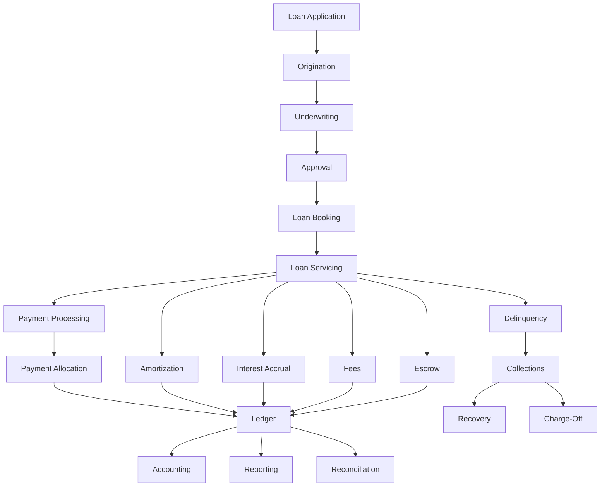
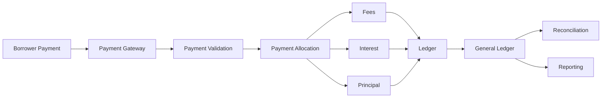
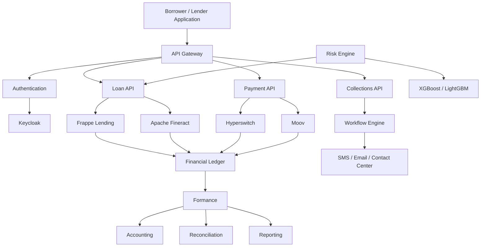

# Awesome-Loan-Servicing-Platform

# 💰 Top Loan Servicing Platforms & Open-Source Loan Servicing Software


> A curated list of **loan servicing platforms, loan management systems, lending cores, commercial lending platforms, mortgage servicing systems and open-source loan servicing software**.


Loan servicing software manages the **post-origination lifecycle of loans**, including:


* Loan boarding

* Amortization schedules

* Interest accrual

* Payment processing

* Payment allocation

* Principal and interest tracking

* Fees

* Escrow

* Delinquency

* Collections

* Charge-offs

* Modifications

* Payoffs

* Statements

* Borrower communications

* Collateral

* Loan accounting

* General ledger integration

* Investor reporting

* Portfolio management

* Reconciliation

* Regulatory reporting


The modern loan-servicing stack increasingly connects **loan origination → underwriting → servicing → payments → collections → accounting → reporting**.


This repository focuses primarily on **open-source and self-hostable alternatives**, while maintaining a separate list of commercial platforms such as LoanPro, TurnKey Lender, Nortridge, Shaw Systems, Fiserv LoanServ, Finastra Loan IQ, FICS, Sagent, CreditOnline, LoanVantage, LendingQB and Mortgage Automator.


> **Important:** Open-source lending software is more mature in **core banking, loan management and lending** than in specialized enterprise mortgage/consumer-loan servicing. There is currently no single open-source project that reproduces every capability of a mature commercial servicing platform.


Apache Fineract provides an open-source core banking platform with loan and savings functionality and an API-first architecture, while Frappe Lending is a dedicated open-source loan-management system covering the lifecycle from loan booking/disbursement through repayment and accounting.


---


## 📑 Table of Contents


* [☁️ SaaS/Hosted Platforms](#️-saashosted-platforms)

* [🌍 Open-Source](#-open-source)

* [🏦 Open-Source Core Banking & Loan Management](#-open-source-core-banking--loan-management)

* [💰 Open-Source Loan Servicing](#-open-source-loan-servicing)

* [🧮 Open-Source Loan Accounting & Ledgers](#-open-source-loan-accounting--ledgers)

* [💳 Open-Source Loan Payment Processing](#-open-source-loan-payment-processing)

* [📅 Open-Source Amortization & Interest Engines](#-open-source-amortization--interest-engines)

* [📈 Open-Source Collections & Delinquency](#-open-source-collections--delinquency)

* [🏠 Open-Source Mortgage & Real Estate Lending](#-open-source-mortgage--real-estate-lending)

* [🏢 Open-Source Commercial Lending](#-open-source-commercial-lending)

* [🤖 Open-Source Loan Origination](#-open-source-loan-origination)

* [🔐 Open-Source Credit & Risk Infrastructure](#-open-source-credit--risk-infrastructure)

* [🧾 Open-Source Accounting & Reconciliation](#-open-source-accounting--reconciliation)

* [⚙️ Open-Source Fintech Infrastructure](#️-open-source-fintech-infrastructure)

* [🧩 Commercial Platform → Open-Source Equivalent](#-commercial-platform--open-source-equivalent)

* [🏗️ Loan Servicing Architecture](#️-loan-servicing-architecture)

* [🔄 Open-Source Loan Servicing Architecture](#-open-source-loan-servicing-architecture)

* [💸 Loan Payment & Ledger Architecture](#-loan-payment--ledger-architecture)

* [📊 Loan Lifecycle](#-loan-lifecycle)

* [⚖️ Commercial vs Open-Source](#️-commercial-vs-open-source)

* [🚀 Recommended Open-Source Stacks](#-recommended-open-source-stacks)

* [📊 Loan Servicing Technology Comparison](#-loan-servicing-technology-comparison)

* [🎯 Recommended Projects by Use Case](#-recommended-projects-by-use-case)

* [🏢 Building a LoanPro Alternative](#-building-a-loanpro-alternative)

* [🏦 Building an Open-Source Loan Servicing Platform](#-building-an-open-source-loan-servicing-platform)

* [🌐 Open-Source Lending Landscape](#-open-source-lending-landscape)

* [🧠 Why Open-Source Loan Servicing Matters](#-why-open-source-loan-servicing-matters)

* [🤝 Contributing](#-contributing)

* [⚠️ Disclaimer](#️-disclaimer)


---


# ☁️ SaaS/Hosted Platforms


Commercial loan-servicing platforms provide configurable servicing engines, workflows, payment processing, collections, accounting and portfolio management.


| Platform                                                               | Company                          | Primary Focus             | Key Capabilities                                                            |

| ---------------------------------------------------------------------- | -------------------------------- | ------------------------- | --------------------------------------------------------------------------- |

| [LoanPro](https://www.loanpro.io/)                                     | LoanPro                          | Modern loan servicing     | API-first servicing, payments, lending core, origination and automation     |

| [TurnKey Lender](https://www.turnkey-lender.com/)                      | TurnKey Lender                   | End-to-end lending        | Origination, underwriting, servicing, collections and reporting             |

| [Nortridge](https://nortridge.com/)                                    | Nortridge Software               | Loan servicing            | Configurable servicing, workflows, complex loan portfolios and origination  |

| [LoanServ](https://www.sagent.com/)                                    | Sagent                           | Mortgage servicing        | Mortgage servicing, borrower management and servicing operations            |

| [Shaw Systems](https://www.shawsystems.com/)                           | Shaw Systems                     | Loan servicing            | Consumer/commercial servicing, collections and portfolio management         |

| [Fiserv LoanServ](https://www.fiserv.com/)                             | Fiserv                           | Enterprise loan servicing | Consumer lending, servicing, payments and financial processing              |

| [Finastra](https://www.finastra.com/)                                  | Finastra                         | Banking & lending         | Lending, core banking and commercial finance                                |

| [Finastra Loan IQ](https://www.finastra.com/solutions/lending/loan-iq) | Finastra                         | Commercial lending        | Commercial loan management, syndication, servicing and lifecycle management |

| [FICS](https://www.fics.com/)                                          | FICS                             | Mortgage servicing        | Mortgage servicing, loan accounting and portfolio management                |

| [Margill](https://www.margill.com/)                                    | Margill                          | Loan management           | Amortization, loan calculations, servicing and portfolio analysis           |

| [SBS Software](https://www.sbs-software.com/)                          | SBS                              | Banking software          | Core banking, lending and financial services                                |

| [SiteOne](https://www.siteone.com/)                                    | SiteOne                          | Loan servicing            | Loan servicing and portfolio management                                     |

| [Sagent](https://www.sagent.com/)                                      | Sagent                           | Mortgage servicing        | Mortgage servicing technology and borrower servicing                        |

| [CreditOnline](https://www.creditonline.com/)                          | CreditOnline                     | Lending software          | Loan origination, credit and loan management                                |

| [Self Financial](https://www.self.inc/)                                | Self                             | Consumer credit           | Credit-building lending and financial products                              |

| [LoanVantage](https://www.loanvantage.com/)                            | LoanVantage                      | Lending platform          | Loan management, servicing and lending workflows                            |

| [LendingQB](https://www.lendingqb.com/)                                | LendingPad / LendingQB ecosystem | Mortgage lending          | Mortgage loan origination and lending workflows                             |

| [Mortgage Automator](https://www.mortgageautomator.com/)               | Mortgage Automator               | Private lending           | Mortgage/private lending origination, servicing and administration          |

| [The Mortgage Office](https://www.themortgageoffice.com/)              | Applied Business Software        | Private lending           | Loan servicing, investor management and mortgage accounting                 |

| [AutoPal](https://www.autopal.info/)                                   | AutoPal Software                 | Loan servicing            | Consumer finance and loan servicing                                         |

| [Bryt](https://www.brytsoftware.com/)                                  | Bryt Software                    | Loan servicing            | Lending and servicing automation                                            |

| [HES LoanBox](https://www.hesfintech.com/)                             | HES FinTech                      | Lending                   | Loan origination, decisioning and servicing                                 |

| [defi SOLUTIONS](https://www.defisolutions.com/)                       | defi SOLUTIONS                   | Consumer lending          | Loan origination, servicing and decisioning                                 |

| [Lendscape](https://www.lendscape.com/)                                | Lendscape                        | Commercial lending        | Asset finance, lending and servicing                                        |

| [Nucleus Software](https://www.nucleussoftware.com/)                   | Nucleus Software                 | Lending                   | Lending and transaction banking                                             |

| [Mambu](https://www.mambu.com/)                                        | Mambu                            | Cloud banking             | Lending and configurable banking infrastructure                             |

| [Temenos](https://www.temenos.com/)                                    | Temenos                          | Core banking              | Lending, core banking and financial services                                |

| [nCino](https://www.ncino.com/)                                        | nCino                            | Cloud banking             | Commercial lending and loan lifecycle management                            |

| [FIS](https://www.fisglobal.com/)                                      | FIS                              | Banking & lending         | Commercial and consumer lending infrastructure                              |


Current industry coverage of loan-servicing software includes providers such as FICS, Nortridge, Shaw Systems, LoanPro, TurnKey Lender, Sagent and other specialist servicing vendors.


---


# 🌍 Open-Source


The open-source ecosystem is more **composable** than the commercial loan-servicing market.


Instead of finding one monolithic "open-source LoanPro", a self-hosted implementation can combine:


```text

                    OPEN-SOURCE LENDING

                            │

        ┌───────────────────┼───────────────────┐

        │                   │                   │

        ▼                   ▼                   ▼

   Core Banking          Loan LMS             Ledger

        │                   │                   │

        ▼                   ▼                   ▼

    Fineract          Frappe Lending        Formance

    Mifos X              Mifos              ERPNext

        │                   │                   │

        └───────────────────┼───────────────────┘

                            │

                            ▼

                    Payments / Collections

                            │

                            ▼

                     Accounting / BI

```


---


# 🏦 Open-Source Core Banking & Loan Management


## Apache Fineract


[Apache Fineract](https://github.com/apache/fineract) is one of the most important open-source projects for lending and core banking.


It provides:


* Loan management

* Savings

* Customers

* Financial products

* Accounting

* Portfolio management

* APIs

* Reporting integrations

* Multi-tenant architecture


Fineract is an API-driven core banking platform and exposes its functionality through APIs rather than providing a complete end-user UI itself.


| Project                                               | Description                                      | License               |

| ----------------------------------------------------- | ------------------------------------------------ | --------------------- |

| [Apache Fineract](https://github.com/apache/fineract) | Open-source core banking and lending platform    | Apache-2.0            |

| [Mifos X](https://github.com/openMF/mifos-x)          | Full distribution around Fineract                | MPL-2.0               |

| [Fineract CN](https://github.com/apache/fineract-cn)  | Modular financial-services platform              | Apache-2.0            |

| [Mifos](https://mifos.org/)                           | Open-source digital financial-services ecosystem | Multiple OSS licenses |

| [Frappe Lending](https://github.com/frappe/lending)   | Dedicated open-source loan-management system     | GPL-3.0               |

| [ERPNext](https://github.com/frappe/erpnext)          | Open-source ERP with financial capabilities      | GPL-3.0               |

| [Odoo Community](https://github.com/odoo/odoo)        | Open-source business/accounting platform         | LGPL-3.0              |


Mifos describes its stack as a composable open-source architecture combining Apache Fineract with reference web/mobile applications and additional components for digital financial services.


---


# 💰 Open-Source Loan Servicing


## Frappe Lending


[Frappe Lending](https://github.com/frappe/lending) is particularly relevant to loan servicing because it explicitly targets the full loan lifecycle.


Capabilities include:


* Loan booking

* Loan products

* Disbursement

* Repayment

* Portfolio management

* Collateral

* Loan accounting

* Collections

* Co-lending

* Loan transfers

* Compliance

* Reporting


Frappe describes the project as a 100% open-source, API-first loan management system covering loan origination through closure.


```text

Loan Application

       │

       ▼

Loan Approval

       │

       ▼

Loan Booking

       │

       ▼

Disbursement

       │

       ▼

Amortization

       │

       ▼

Repayment

       │

       ▼

Collections

       │

       ▼

Payoff / Closure

```


---


## Apache Fineract


Fineract is particularly useful where servicing needs to be part of a broader financial-services platform:


```text

Customer

   │

   ▼

Loan Product

   │

   ▼

Loan Account

   │

   ├── Schedule

   ├── Accrual

   ├── Payments

   ├── Charges

   ├── Accounting

   └── Reporting

```


Fineract's API-first design makes it suitable as the servicing backend underneath a custom borrower portal or fintech application.


---


# 🧮 Open-Source Loan Accounting & Ledgers


A serious loan-servicing system needs a reliable financial ledger.


```text

                    Loan Event

                        │

                        ▼

                 Servicing Engine

                        │

              ┌─────────┴─────────┐

              ▼                   ▼

          Principal             Interest

              │                   │

              └─────────┬─────────┘

                        ▼

                     Ledger

                        │

                        ▼

                  General Ledger

```


| Project                                                 | Role                               |

| ------------------------------------------------------- | ---------------------------------- |

| [Formance Ledger](https://github.com/formancehq/ledger) | Programmable financial ledger      |

| [Apache Fineract](https://github.com/apache/fineract)   | Loan accounting / core banking     |

| [Frappe Lending](https://github.com/frappe/lending)     | Integrated loan accounting         |

| [ERPNext](https://github.com/frappe/erpnext)            | General accounting                 |

| [Odoo Community](https://github.com/odoo/odoo)          | Accounting                         |

| [Kill Bill](https://github.com/killbill/killbill)       | Billing and financial transactions |


A useful architecture is:


```text

Loan Servicing

      │

      ▼

Transaction Events

      │

      ▼

Double-Entry Ledger

      │

      ├── Principal Receivable

      ├── Interest Receivable

      ├── Fees

      ├── Cash

      └── Loss / Charge-off

```


---


# 💳 Open-Source Loan Payment Processing


Loan servicing must turn incoming payments into accounting events.


```text

Borrower Payment

      │

      ▼

Payment Gateway

      │

      ▼

Payment Validation

      │

      ▼

Payment Allocation

      │

 ┌────┼─────────────┐

 ▼    ▼             ▼

Fees Interest   Principal

 │      │            │

 └──────┼────────────┘

        ▼

      Ledger

```


Useful projects:


| Project                                              | Role                                 |

| ---------------------------------------------------- | ------------------------------------ |

| [Moov](https://github.com/moov-io)                   | Open-source financial infrastructure |

| [Moov ACH](https://github.com/moov-io/ach)           | ACH processing                       |

| [Hyperswitch](https://github.com/juspay/hyperswitch) | Payment orchestration                |

| [Formance](https://github.com/formancehq/stack)      | Financial transactions               |

| [jPOS](https://github.com/jpos/jPOS)                 | ISO 8583 payment processing          |

| [Kill Bill](https://github.com/killbill/killbill)    | Payment and billing infrastructure   |

| [Mojaloop](https://github.com/mojaloop/mojaloop)     | Interoperable payment infrastructure |


---


# 📅 Open-Source Amortization & Interest Engines


Loan servicing depends heavily on correctly calculating:


* Principal

* Interest

* Accrued interest

* Daily interest

* Periodic interest

* Fees

* Penalties

* Payment allocation

* Balloon payments

* Grace periods

* Prepayments

* Payoffs

* Amortization schedules


Projects and frameworks that can contribute to this layer include:


| Project                                                       | Role                                                  |

| ------------------------------------------------------------- | ----------------------------------------------------- |

| [Apache Fineract](https://github.com/apache/fineract)         | Loan schedules and servicing calculations             |

| [Frappe Lending](https://github.com/frappe/lending)           | Loan schedules and lending calculations               |

| [Mifos X](https://github.com/openMF/mifos-x)                  | Loan and savings management                           |

| [Margill](https://www.margill.com/)                           | Commercial reference point for financial calculations |

| [QuantLib](https://github.com/lballabio/QuantLib)             | Open-source quantitative-finance library              |

| [OpenGamma Strata](https://github.com/OpenGamma/Strata)       | Open-source financial calculations                    |

| [Apache Commons Math](https://github.com/apache/commons-math) | Mathematical building blocks                          |


> Quantitative-finance libraries are **components**, not complete loan-servicing platforms.


---


# 📈 Open-Source Collections & Delinquency


Loan servicing becomes significantly more complex once an account becomes delinquent.


```text

                    Loan

                     │

                     ▼

                  Due Date

                     │

                ┌────┴────┐

                │ Paid?   │

                └────┬────┘

                     │

                    No

                     │

                     ▼

                  DPD 1+

                     │

                     ▼

              Collections Queue

                     │

          ┌──────────┼──────────┐

          ▼          ▼          ▼

       Email       SMS        Calls

          │          │          │

          └──────────┼──────────┘

                     ▼

               Promise to Pay

                     │

              ┌──────┴──────┐

              ▼             ▼

            Paid          Broken

              │             │

              ▼             ▼

            Close       Escalation

```


Potential building blocks:


| Project                                               | Role                                    |

| ----------------------------------------------------- | --------------------------------------- |

| [Frappe Lending](https://github.com/frappe/lending)   | Loan collections and delinquency        |

| [Apache Fineract](https://github.com/apache/fineract) | Loan lifecycle and portfolio management |

| [Mifos X](https://github.com/openMF/mifos-x)          | Loan portfolio management               |

| [ERPNext](https://github.com/frappe/erpnext)          | Workflow / accounting                   |

| [Temporal](https://github.com/temporalio/temporal)    | Durable collection workflows            |

| [Camunda](https://github.com/camunda/camunda)         | BPMN workflows                          |

| [NATS](https://github.com/nats-io/nats-server)        | Event messaging                         |


---


# 🏠 Open-Source Mortgage & Real Estate Lending


Mortgage servicing has specialized requirements around:


* Escrow

* Property taxes

* Insurance

* Investor reporting

* Collateral

* Foreclosure

* Loss mitigation

* Mortgage modifications

* PMI

* Payoff statements

* Servicing transfers


There is **no single broadly adopted open-source project equivalent to a large enterprise mortgage-servicing platform such as LoanServ**.


Instead, an open-source architecture can combine:


```text

Apache Fineract

      +

Frappe Lending

      +

PostgreSQL

      +

Workflow Engine

      +

Document Management

      +

Accounting

      +

Payment Infrastructure

```


Useful adjacent projects:


| Project                                               | Role                        |

| ----------------------------------------------------- | --------------------------- |

| [Apache Fineract](https://github.com/apache/fineract) | Core lending                |

| [Frappe Lending](https://github.com/frappe/lending)   | Loan management             |

| [ERPNext](https://github.com/frappe/erpnext)          | Accounting                  |

| [OpenProject](https://github.com/opf/openproject)     | Workflow/project management |

| [Temporal](https://github.com/temporalio/temporal)    | Servicing workflows         |

| [Camunda](https://github.com/camunda/camunda)         | Process automation          |


---


# 🏢 Open-Source Commercial Lending


Commercial lending introduces:


* Multiple facilities

* Credit limits

* Commitments

* Drawdowns

* Syndications

* Participants

* Collateral

* Covenants

* Interest-rate resets

* Fees

* Tranches

* Amendments

* Agency operations


This is an area where **Finastra Loan IQ-class functionality is substantially more specialized than most open-source lending systems**.


Potential building blocks include:


| Project                                                 | Role                   |

| ------------------------------------------------------- | ---------------------- |

| [Apache Fineract](https://github.com/apache/fineract)   | Lending core           |

| [Frappe Lending](https://github.com/frappe/lending)     | Loan management        |

| [Formance](https://github.com/formancehq/ledger)        | Financial ledger       |

| [QuantLib](https://github.com/lballabio/QuantLib)       | Financial calculations |

| [OpenGamma Strata](https://github.com/OpenGamma/Strata) | Financial calculations |

| [Temporal](https://github.com/temporalio/temporal)      | Workflow orchestration |

| [Camunda](https://github.com/camunda/camunda)           | Workflow/BPMN          |


---


# 🤖 Open-Source Loan Origination


Loan servicing begins after origination, but an integrated platform often needs both.


A modern open-source architecture can use:


```text

Application

    │

    ▼

Loan Origination

    │

    ├── KYC

    ├── Credit Check

    ├── Underwriting

    ├── Risk

    └── Approval

    │

    ▼

Loan Booking

    │

    ▼

Loan Servicing

```


### Apache Fineract Loan Origination


A 2026 Apache Fineract project includes a loan-origination proof of concept that provides application workflows, credit assessment, approvals and integration with Fineract; its own documentation explicitly describes it as **not production-ready** without further hardening, testing and compliance work.


| Project                                                                                 | Role                          |

| --------------------------------------------------------------------------------------- | ----------------------------- |

| [Apache Fineract](https://github.com/apache/fineract)                                   | Core lending                  |

| [Fineract Loan Origination](https://apache.googlesource.com/fineract-loan-origination/) | Loan-origination POC          |

| [Frappe Lending](https://github.com/frappe/lending)                                     | Lending lifecycle             |

| [Mifos Workflow](https://github.com/openMF/mifos-workflow)                              | Workflow-driven lending       |

| [ERPNext](https://github.com/frappe/erpnext)                                            | Business / financial platform |


---


# 🔐 Open-Source Credit & Risk Infrastructure


A servicing platform normally depends on external credit and risk systems.


Open-source building blocks include:


| Project                                                       | Role                           |

| ------------------------------------------------------------- | ------------------------------ |

| [Apache Fineract](https://github.com/apache/fineract)         | Lending and portfolio data     |

| [Frappe Lending](https://github.com/frappe/lending)           | Loan risk/compliance workflows |

| [Open Policy Agent](https://github.com/open-policy-agent/opa) | Policy decision engine         |

| [MLflow](https://github.com/mlflow/mlflow)                    | Model lifecycle                |

| [Feast](https://github.com/feast-dev/feast)                   | Feature store                  |

| [XGBoost](https://github.com/dmlc/xgboost)                    | Credit-risk modeling           |

| [LightGBM](https://github.com/microsoft/LightGBM)             | Gradient-boosted models        |

| [scikit-learn](https://github.com/scikit-learn/scikit-learn)  | Machine learning               |


Example:


```text

Loan Application

      │

      ▼

Feature Store

      │

      ▼

Risk Model

      │

      ▼

Credit Score

      │

      ▼

Policy Engine

      │

      ▼

Approve / Review / Reject

```


---


# 🧾 Open-Source Accounting & Reconciliation


A loan-servicing system needs to reconcile:


```text

Loan System

     │

     ├── Principal

     ├── Interest

     ├── Fees

     ├── Payments

     └── Adjustments

             │

             ▼

       Financial Ledger

             │

             ▼

      General Ledger

             │

             ▼

       Bank Statement

             │

             ▼

       Reconciliation

```


| Project                                                 | Function               |

| ------------------------------------------------------- | ---------------------- |

| [Formance Ledger](https://github.com/formancehq/ledger) | Financial ledger       |

| [ERPNext](https://github.com/frappe/erpnext)            | Accounting             |

| [Odoo Community](https://github.com/odoo/odoo)          | Accounting             |

| [Apache Fineract](https://github.com/apache/fineract)   | Financial accounting   |

| [Frappe Lending](https://github.com/frappe/lending)     | Loan accounting        |

| [Kill Bill](https://github.com/killbill/killbill)       | Billing / transactions |


---


# ⚙️ Open-Source Fintech Infrastructure


| Layer            | Open-Source Projects            |

| ---------------- | ------------------------------- |

| Core Banking     | Apache Fineract, Mifos X        |

| Loan Management  | Frappe Lending                  |

| Loan Origination | Fineract LOS, Mifos Workflow    |

| Ledger           | Formance, Fineract              |

| Payments         | Hyperswitch, Moov               |

| ACH              | Moov ACH                        |

| ISO 8583         | jPOS, Moov ISO 8583             |

| Accounting       | ERPNext, Odoo                   |

| Risk             | XGBoost, LightGBM, scikit-learn |

| Policy           | Open Policy Agent               |

| Workflow         | Temporal, Camunda               |

| Authentication   | Keycloak                        |

| Database         | PostgreSQL                      |

| Messaging        | Kafka, NATS                     |

| API Gateway      | Kong, Traefik                   |

| Observability    | Prometheus, Grafana             |

| Object Storage   | MinIO                           |

| Containers       | Docker, Kubernetes              |


---


# 🧩 Commercial Platform → Open-Source Equivalent


| Commercial Platform                 | Open-Source Equivalent / Building Blocks                 |

| ----------------------------------- | -------------------------------------------------------- |

| **LoanPro**                         | Frappe Lending + Formance + Hyperswitch                  |

| **TurnKey Lender**                  | Frappe Lending + Fineract + workflow engine              |

| **Nortridge**                       | Frappe Lending + Fineract + Temporal/Camunda             |

| **LoanServ**                        | Fineract + Frappe Lending + workflow + accounting        |

| **Shaw Systems**                    | Fineract + Frappe Lending + collections workflows        |

| **Fiserv LoanServ**                 | Fineract + Formance + ERPNext + workflow                 |

| **Finastra**                        | Fineract + Formance + financial calculation libraries    |

| **Finastra Loan IQ**                | Fineract + Formance + Strata/QuantLib + workflow         |

| **FICS**                            | Fineract + Frappe Lending + mortgage-specific modules    |

| **Margill**                         | QuantLib + OpenGamma Strata + custom amortization engine |

| **SBS Software**                    | Fineract + Formance + ERPNext                            |

| **SiteOne Loan Servicing**          | Frappe Lending + Fineract + Formance                     |

| **Sagent**                          | Fineract + Frappe Lending + workflow + document services |

| **CreditOnline**                    | Fineract + Frappe Lending + risk stack                   |

| **Self Financial**                  | Fineract + Formance + custom consumer-finance services   |

| **LoanVantage**                     | Frappe Lending + Fineract + workflow                     |

| **LendingQB**                       | Fineract LOS + workflow + Frappe Lending                 |

| **Mortgage Automator**              | Frappe Lending + Fineract + mortgage-specific extensions |

| **The Mortgage Office**             | Frappe Lending + ERPNext + Formance                      |

| **AutoPal**                         | Frappe Lending + Fineract + Formance                     |

| **HES LoanBox**                     | Fineract + Frappe Lending + risk engine                  |

| **defi SOLUTIONS**                  | Fineract + workflow + risk engine                        |

| **Mambu Lending**                   | Apache Fineract + Formance                               |

| **Enterprise Loan Servicing**       | Fineract + Frappe Lending + Formance + workflow          |

| **Open-Source LoanPro Alternative** | Frappe Lending + Formance + Hyperswitch + PostgreSQL     |


---


# 🏗️ Loan Servicing Architecture





---


# 🔄 Open-Source Loan Servicing Architecture


```text

                         BORROWER

                            │

                            ▼

                     Borrower Portal

                            │

                            ▼

                       Loan API

                            │

             ┌──────────────┼──────────────┐

             │              │              │

             ▼              ▼              ▼

          Fineract      Frappe Lending   Custom LMS

             │              │              │

             └──────────────┼──────────────┘

                            ▼

                    SERVICING ENGINE

                            │

       ┌────────────────────┼────────────────────┐

       │                    │                    │

       ▼                    ▼                    ▼

 Amortization          Payments             Collections

       │                    │                    │

       └────────────────────┼────────────────────┘

                            ▼

                     Formance Ledger

                            │

              ┌─────────────┼─────────────┐

              ▼             ▼             ▼

         Accounting    Reconciliation   Reporting

```


---


# 💸 Loan Payment & Ledger Architecture





---


# 📊 Loan Lifecycle


A complete servicing system can be represented as:


```text

                    LOAN LIFECYCLE


Application

     │

     ▼

Underwriting

     │

     ▼

Approval

     │

     ▼

Booking

     │

     ▼

Disbursement

     │

     ▼

Active Servicing

     │

     ├──────────────┐

     │              │

     ▼              ▼

Payments       Amendments

     │              │

     ▼              ▼

Reconciliation  Restructuring

     │              │

     └───────┬──────┘

             ▼

        Delinquency?

             │

        ┌────┴────┐

        │         │

       No        Yes

        │         │

        ▼         ▼

     Continue  Collections

                  │

            ┌─────┴─────┐

            ▼           ▼

         Recovery    Charge-off

            │           │

            └─────┬─────┘

                  ▼

                Payoff

                  │

                  ▼

                Closure

```


---


# ⚖️ Commercial vs Open-Source


| Capability             | Commercial Servicing Platform | Open-Source Stack              |

| ---------------------- | ----------------------------- | ------------------------------ |

| Loan Accounts          | ✅                             | ✅                              |

| Loan Products          | ✅                             | ✅                              |

| Amortization           | ✅                             | ✅                              |

| Interest Accrual       | ✅                             | ✅                              |

| Payment Processing     | ✅                             | ✅                              |

| Payment Allocation     | ✅                             | ✅                              |

| Fees                   | ✅                             | ✅                              |

| Delinquency            | ✅                             | ✅                              |

| Collections            | ✅                             | ✅ Building Blocks              |

| Charge-Offs            | ✅                             | ✅                              |

| Loan Modifications     | ✅                             | ✅ / Custom                     |

| Payoffs                | ✅                             | ✅                              |

| Borrower Portal        | Often                         | Build / Integrate              |

| Investor Reporting     | Often                         | Build / Integrate              |

| Mortgage Escrow        | Specialized                   | Custom                         |

| Mortgage Servicing     | Specialized                   | Significant customization      |

| Commercial Syndication | Specialized                   | Significant customization      |

| Accounting             | ✅                             | ✅                              |

| Reconciliation         | ✅                             | Build / integrate              |

| APIs                   | Usually                       | ✅                              |

| Source Code            | ❌                             | ✅                              |

| Self Hosting           | Varies                        | ✅                              |

| Customization          | Medium/High                   | Very High                      |

| Vendor Lock-in         | Higher                        | Lower                          |

| Regulatory Support     | Often integrated              | Self-managed                   |

| Support                | Vendor                        | Community / Commercial support |

| Implementation         | Faster                        | More engineering               |

| Infrastructure         | Managed                       | Self-managed                   |

| Data Ownership         | Vendor-dependent              | Full control                   |


---


# 📊 Loan Servicing Technology Comparison


| Project          | Loan Servicing | Core Banking | Lending | Accounting | Payments | Self-Host |

| ---------------- | :------------: | :----------: | :-----: | :--------: | :------: | :-------: |

| Apache Fineract  |        ✅       |       ✅      |    ✅    |      ✅     |    ⚠️    |     ✅     |

| Frappe Lending   |        ✅       |      ⚠️      |    ✅    |      ✅     |    ⚠️    |     ✅     |

| Mifos X          |        ✅       |       ✅      |    ✅    |      ✅     |    ⚠️    |     ✅     |

| Fineract CN      |        ✅       |       ✅      |    ✅    |     ⚠️     |    ⚠️    |     ✅     |

| Formance         |       ⚠️       |       ❌      |    ⚠️   |      ✅     |     ✅    |     ✅     |

| ERPNext          |       ⚠️       |       ❌      |    ⚠️   |      ✅     |    ⚠️    |     ✅     |

| Odoo Community   |       ⚠️       |       ❌      |    ⚠️   |      ✅     |    ⚠️    |     ✅     |

| Kill Bill        |       ⚠️       |       ❌      |    ❌    |      ✅     |     ✅    |     ✅     |

| Hyperswitch      |        ❌       |       ❌      |    ❌    |     ⚠️     |     ✅    |     ✅     |

| Moov             |        ❌       |       ❌      |    ❌    |     ⚠️     |     ✅    |     ✅     |

| QuantLib         |        ❌       |       ❌      |    ⚠️   |      ❌     |     ❌    |     ✅     |

| OpenGamma Strata |        ❌       |       ❌      |    ⚠️   |      ❌     |     ❌    |     ✅     |


---


# 🚀 Recommended Open-Source Stacks


## 🏆 1. General-Purpose Loan Servicing


```text

Frappe Lending

      +

PostgreSQL

      +

Formance Ledger

      +

FastAPI

      +

Keycloak

```


Good starting architecture for consumer, SME and specialty lending.


---


## 🏦 2. Core-Banking-Based Lending


```text

Apache Fineract

      +

Mifos X

      +

Formance

      +

Moov

      +

PostgreSQL

```


Useful when lending is part of a broader banking platform.


Mifos explicitly describes the Fineract/Mifos architecture as modular and deployable either as a complete financial-services platform or as building blocks for embedded finance.


---


## ⚡ 3. API-First LoanPro-Style Architecture


```text

FastAPI / Kong

      │

      ▼

Frappe Lending

      │

      ▼

Formance Ledger

      │

      ├── Hyperswitch

      ├── Moov

      └── Bank / Payment APIs

```


---


## 🏠 4. Mortgage-Oriented Stack


```text

Fineract

   +

Frappe Lending

   +

Mortgage Extensions

   +

Workflow Engine

   +

ERPNext

   +

Document Management

```


A production mortgage-servicing implementation would require substantial domain-specific customization around escrow, investor reporting, loss mitigation, foreclosure and regulatory workflows.


---


## 🏢 5. Commercial Lending


```text

Apache Fineract

      +

Formance

      +

OpenGamma Strata

      +

QuantLib

      +

Temporal

      +

PostgreSQL

```


This provides a composable foundation for:


* Facilities

* Loans

* Drawdowns

* Interest calculations

* Fees

* Workflows

* Financial accounting


---


## 💳 6. Consumer Lending


```text

Frappe Lending

      +

Formance

      +

Hyperswitch

      +

Moov

      +

Keycloak

      +

PostgreSQL

```


---


# 🎯 Recommended Projects by Use Case


| Use Case                                     | Recommended Starting Point                         |

| -------------------------------------------- | -------------------------------------------------- |

| General loan servicing                       | **Frappe Lending**                                 |

| Core banking + lending                       | **Apache Fineract**                                |

| Full open-source financial-services platform | **Mifos X + Fineract**                             |

| API-first lending                            | **Fineract / Frappe Lending**                      |

| Loan accounting                              | **Frappe Lending + Formance**                      |

| Double-entry financial ledger                | **Formance Ledger**                                |

| Loan origination                             | **Fineract LOS / Frappe Lending**                  |

| Consumer lending                             | **Frappe Lending + Formance**                      |

| SME lending                                  | **Frappe Lending + Fineract**                      |

| Microfinance                                 | **Apache Fineract / Mifos**                        |

| Loan payments                                | **Moov + Hyperswitch**                             |

| ACH payments                                 | **Moov ACH**                                       |

| Payment orchestration                        | **Hyperswitch**                                    |

| Credit risk                                  | **XGBoost / LightGBM + OPA**                       |

| Workflow automation                          | **Temporal / Camunda**                             |

| Mortgage servicing foundation                | **Fineract + Frappe Lending**                      |

| Commercial lending foundation                | **Fineract + Formance + Strata**                   |

| Financial calculations                       | **QuantLib / OpenGamma Strata**                    |

| Accounting                                   | **ERPNext / Odoo**                                 |

| Full self-hosted lending stack               | **Frappe Lending + Formance + Moov + Hyperswitch** |


---


# 🏢 Building a LoanPro Alternative


LoanPro describes its platform as an API-first lending and credit platform with a modern lending core, origination and payments/servicing capabilities.


An open-source equivalent can be decomposed into:


```text

                         CLIENT

                           │

                           ▼

                      API GATEWAY

                           │

                           ▼

                   LOAN MANAGEMENT API

                           │

              ┌────────────┼────────────┐

              │            │            │

              ▼            ▼            ▼

           Lending      Servicing    Payments

              │            │            │

              └────────────┼────────────┘

                           ▼

                    Frappe Lending

                           │

                           ▼

                    Formance Ledger

                           │

             ┌─────────────┼─────────────┐

             ▼             ▼             ▼

          Accounting   Collections   Reporting

```


### Suggested Components


```text

Loan Management      → Frappe Lending

Core Banking         → Apache Fineract

Ledger               → Formance

Payments             → Hyperswitch

ACH                  → Moov ACH

ISO 8583             → jPOS

Risk                 → XGBoost / LightGBM

Policy               → Open Policy Agent

Workflow             → Temporal

Accounting           → ERPNext

Authentication       → Keycloak

Database             → PostgreSQL

Messaging            → Kafka / NATS

API Gateway          → Kong

Observability        → Prometheus + Grafana

```


---


# 🏦 Building an Open-Source Loan Servicing Platform





---


# 🧱 Loan Servicing Infrastructure Layers


```text

┌────────────────────────────────────────────────┐

│                 BORROWER APPS                  │

│ Web • Mobile • Partner APIs • Portals          │

└───────────────────────┬────────────────────────┘

                        │

┌───────────────────────▼────────────────────────┐

│                    API LAYER                   │

│       FastAPI • Kong • OpenAPI • OAuth         │

└───────────────────────┬────────────────────────┘

                        │

┌───────────────────────▼────────────────────────┐

│              LOAN SERVICING CORE               │

│     Frappe Lending • Apache Fineract           │

└───────────────────────┬────────────────────────┘

                        │

┌───────────────────────▼────────────────────────┐

│              SERVICING ENGINE                  │

│ Schedules • Accruals • Payments • Fees         │

└───────────────────────┬────────────────────────┘

                        │

┌───────────────────────▼────────────────────────┐

│                    LEDGER                      │

│             Formance • Fineract                │

└───────────────────────┬────────────────────────┘

                        │

┌───────────────────────▼────────────────────────┐

│              PAYMENTS / COLLECTIONS            │

│     Moov • Hyperswitch • ACH • Banks           │

└───────────────────────┬────────────────────────┘

                        │

┌───────────────────────▼────────────────────────┐

│             ACCOUNTING / REPORTING             │

│ ERPNext • PostgreSQL • BI • Reconciliation     │

└────────────────────────────────────────────────┘

```


---


# 🌐 Open-Source Lending Landscape


```mermaid

mindmap

  root((Open-Source Lending))

    Core Banking

      Apache Fineract

      Fineract CN

      Mifos X

      Mifos

    Loan Management

      Frappe Lending

      Apache Fineract

      Mifos

    Loan Origination

      Fineract LOS

      Mifos Workflow

      Frappe Lending

    Ledger

      Formance

      Fineract

      ERPNext

    Payments

      Moov

      Hyperswitch

      jPOS

      Kill Bill

    ACH

      Moov ACH

    Risk

      XGBoost

      LightGBM

      scikit-learn

      Feast

      MLflow

    Accounting

      ERPNext

      Odoo

    Workflow

      Temporal

      Camunda

    Infrastructure

      PostgreSQL

      Kafka

      NATS

      Kubernetes

      Docker

    Applications

      Consumer Lending

      SME Lending

      Microfinance

      Mortgage

      Commercial Lending

      Embedded Finance

      Neobanks

```


---


# 🧠 Why Open-Source Loan Servicing Matters


Commercial servicing systems often sit at the center of a lender's technology stack:


```text

                    LENDER

                       │

                       ▼

                Loan Origination

                       │

                       ▼

                 Loan Servicing

                       │

       ┌───────────────┼───────────────┐

       ▼               ▼               ▼

    Payments       Collections     Accounting

       │               │               │

       └───────────────┼───────────────┘

                       ▼

                    Reporting

```


The servicing system therefore becomes a critical source of:


* Financial data

* Customer data

* Payment history

* Interest calculations

* Delinquency status

* Collections status

* Portfolio performance

* Accounting events


An open-source approach makes it possible to own more of this architecture:


```text

              COMMERCIAL APPROACH


                 Lender App

                     │

                     ▼

             Proprietary LMS

                     │

             Proprietary APIs

                     │

                     ▼

                Integrations


              OPEN-SOURCE APPROACH


                 Lender App

                     │

                     ▼

                  Your API

                     │

          ┌──────────┼──────────┐

          ▼          ▼          ▼

       Fineract    Frappe     Formance

                    Lending

          │          │          │

          └──────────┼──────────┘

                     ▼

              Your Infrastructure

```


The strongest open-source opportunity is therefore not necessarily a one-for-one clone of every commercial product.


It is a **composable lending operating system** assembled from:


```text

Core Banking

+

Loan Servicing

+

Ledger

+

Payments

+

Collections

+

Risk

+

Accounting

+

Workflow

+

APIs

```


---


# 🔥 Open-Source Loan Servicing Reference Stack


```text

                         LENDER

                           │

                           ▼

                    Customer Portal

                           │

                           ▼

                     API Gateway

                           │

                           ▼

                    Apache Fineract

                           │

                    ┌──────┴──────┐

                    ▼             ▼

              Frappe Lending   Loan Products

                    │

                    ▼

               Servicing Engine

                    │

       ┌────────────┼────────────┐

       ▼            ▼            ▼

    Payments    Collections   Adjustments

       │            │            │

       └────────────┼────────────┘

                    ▼

              Formance Ledger

                    │

          ┌─────────┼─────────┐

          ▼         ▼         ▼

      Accounting  Reconcile  Analytics

          │

          ▼

       ERPNext

```


---


# 🧩 Commercial → OSS Architecture Mapping


```text

LoanPro

  │

  ├── Lending Core       → Frappe Lending / Fineract

  ├── Loan Servicing     → Frappe Lending

  ├── Payments           → Hyperswitch / Moov

  ├── Ledger             → Formance

  └── APIs               → FastAPI / Kong


Nortridge

  │

  ├── Loan Management    → Frappe Lending

  ├── Servicing          → Fineract / Frappe Lending

  ├── Workflows          → Temporal / Camunda

  └── Accounting         → Formance / ERPNext


LoanServ / Sagent

  │

  ├── Mortgage Core      → Fineract foundation

  ├── Servicing          → Frappe Lending

  ├── Accounting         → ERPNext / Formance

  ├── Workflows          → Camunda / Temporal

  └── Reporting          → PostgreSQL / BI


Finastra Loan IQ

  │

  ├── Loan Core          → Fineract

  ├── Ledger             → Formance

  ├── Calculations       → Strata / QuantLib

  ├── Workflows          → Temporal

  └── Reporting          → PostgreSQL / BI


TurnKey Lender

  │

  ├── Origination        → Fineract LOS

  ├── Lending            → Frappe Lending

  ├── Servicing          → Frappe Lending

  ├── Risk               → XGBoost / LightGBM

  └── Workflow           → Temporal


Mortgage Automator

  │

  ├── Loan Origination   → Fineract LOS

  ├── Loan Servicing     → Frappe Lending

  ├── Accounting         → ERPNext

  ├── Ledger             → Formance

  └── Workflow           → Temporal

```


---


# 🚀 Minimal Self-Hosted Loan Servicing


A practical development stack:


```text

Frappe Lending

+

PostgreSQL

+

Formance

+

Keycloak

+

FastAPI

+

Docker

```


Then add:


```text

                 Frappe Lending

                       │

                       ▼

                Formance Ledger

                       │

        ┌──────────────┼──────────────┐

        ▼              ▼              ▼

      Moov        Hyperswitch       ERPNext

        │              │              │

        └──────────────┼──────────────┘

                       ▼

                 Reconciliation

                       │

                       ▼

                    BI / Data

```


For a broader core-banking system:


```text

Apache Fineract

+

Mifos X

+

Frappe Lending

+

Formance

+

Moov

+

Hyperswitch

```


---


# 🔬 Loan Servicing Engineering Principles


A production-grade open-source servicing platform should prioritize:


### 1. Immutable Financial Events


```text

Loan Event

    │

    ▼

Immutable Transaction

    │

    ▼

Ledger Entry

```


Avoid directly mutating historical financial transactions.


### 2. Deterministic Amortization


The same:


```text

Principal

+

Interest Rate

+

Term

+

Frequency

+

Dates

+

Rules

```


should produce the same schedule.


### 3. Event-Driven Servicing


```text

PaymentReceived

       │

       ├── AllocatePayment

       ├── UpdateBalance

       ├── UpdateDelinquency

       ├── CreateLedgerEntries

       └── GenerateReceipt

```


### 4. Complete Auditability


Every servicing change should be traceable:


```text

Who

+

What

+

When

+

Before

+

After

+

Reason

```


### 5. Separation of Concerns


```text

Loan State

    ≠

Ledger State

    ≠

Payment State

    ≠

Accounting State

```


This makes reconciliation and auditing substantially easier.


---


# 🤝 Contributing


Contributions are welcome!


Please consider adding:


* Open-source loan-servicing systems

* Core banking platforms

* Loan-management systems

* Loan-origination systems

* Mortgage software

* Commercial lending software

* Consumer lending software

* Microfinance platforms

* Amortization libraries

* Interest-calculation engines

* Loan ledgers

* Payment-processing systems

* ACH infrastructure

* Collections systems

* Credit-risk engines

* Lending workflow engines

* Accounting systems

* Reconciliation tools

* Borrower portals

* Loan APIs

* Open-source fintech infrastructure


When adding a project, distinguish carefully between:


* **Fully open-source**

* **Open-core**

* **Source available**

* **Community edition**

* **Commercial software using open-source components**

* **Open-source libraries**

* **Hosted services**


The open-source status of a project can change over time, so verify the current repository license and commercial-use terms before adding it.


---


# ⚠️ Disclaimer


This repository is an independent technical curation and is **not affiliated with or endorsed by any company or project listed here**.


Loan servicing is a highly specialized financial domain.


Open-source software can provide:


* Loan accounts

* Amortization

* Interest calculations

* Payments

* Accounting

* Collections

* Lending workflows

* Ledgers

* APIs

* Reporting

* Reconciliation


But software alone does **not** provide:


* Lending licenses

* Banking licenses

* Regulatory authorization

* Credit-bureau access

* Payment-rail access

* ACH sponsorship

* Card-network access

* Mortgage servicing rights

* Investor relationships

* Regulatory reporting responsibility

* Consumer-protection compliance

* Data privacy compliance


Mortgage and commercial lending can require particularly extensive domain-specific customization.


The mapping between commercial products and open-source projects in this repository is therefore an **architectural equivalence**, not a claim that the open-source projects are feature-for-feature replacements.


Always verify current licensing, regulatory requirements, security requirements, financial calculations and jurisdiction-specific lending rules before using any software in production.


---


## ⭐ Star This Repository


If you are interested in:


* Loan Servicing

* Loan Management

* Lending

* Core Banking

* Digital Lending

* Mortgage Servicing

* Consumer Lending

* Commercial Lending

* Fintech Infrastructure

* Open-Source Banking

* Financial Ledgers

* Loan APIs


consider giving this repository a ⭐ **Star** and contributing new projects.


---


**Last updated: September 2026**
